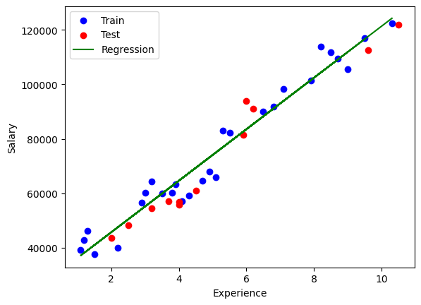

# Salary Prediction Based on Work Experience

## Project Overview

This project implements **Linear Regression** from scratch to predict salaries based on years of experience. The goal is to understand and apply linear regression at a fundamental level.

## Dataset

The dataset contains two columns:
- **Years of Experience** (Feature)
- **Salary** (Target)

Dataset Source: [Salary Data CSV](https://raw.githubusercontent.com/howsam/pytorch-course-free/refs/heads/main/week%202%20linear%20regression%20from%20scratch/Salary%20Data.csv)

No preprocessing has been applied.

## Model

The model used is a **Linear Regression** model, trained to learn a function mapping experience to salary.

## Regression Line on Data

_This section visualizes the dataset and the learned regression line._

